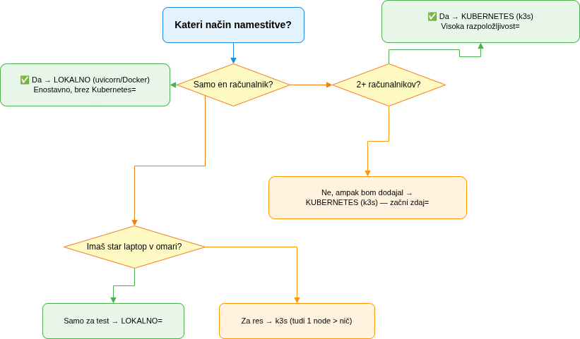
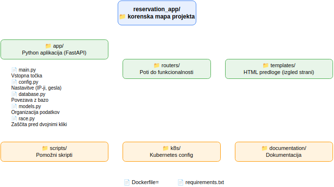

🌐 **Language / Jezik:** [🇸🇮 Slovenščina](../admin-devops-navodila.md) | [🇬🇧 English](admin-devops-navodila.md)

---

> ⚠️ **Note:** IP addresses, passwords, email addresses, and other sensitive data
> in this documentation are replaced with examples. For actual values, check
> Kubernetes Secrets or contact the administrator.

---

# ⚙️ Admin & DevOps Guide

---

## 📋 Table of Contents

1. [What the application offers — and what that means in practice](#what-the-application-offers)
2. [Installing Ubuntu Server 24.04 — with step explanations](#0-installing-ubuntu-server-2404-lts)
3. [Installation methods — when to use which](#installation-methods)
4. [📖 Which method should you use? — decision guide](#-which-method-should-you-use-decision-guide)
5. [Maintenance and automation — cron jobs that take care of themselves](#maintenance-and-automation-cron-jobs)
6. [AI agents for help](#ai-agents-for-assistance)
7. [Adding a new computer to the k3s cluster — step by step](#adding-a-new-computer-to-the-k3s-cluster)

---

## What the application offers — and what that means in practice

The app solves one main problem: **who is where and when, and when are assessments.**
Instead of teachers chasing each other down the hallways and copying from paper
to paper, everything is in one place.

### Rooms for reservations

| Room | Capacity | How it works | In practice... |
|------|----------|-------------|----------------|
| **📱 Tablets** | 28 units | Can be shared by multiple teachers in the **same period** | If Mateja takes 14 tablets, Ana can still take 14 — the app makes sure it doesn't go over 28 |
| **💻 Computer room** | 1 reservation per period | Reserve the whole room | When you're in, others can't enter — like having the only key |
| **🚢 Ship** | 1 reservation per period | Same as the computer room | Same principle, different room |
| **🍳 Home economics** | 1 reservation per period | Same as above | Same principle, different room |

**Why is that?** Tablets are physical items — they can be split up. Rooms are
rooms — you can't physically fit two classes in one room at the same time.

### Other features

- **📝 Assessments** — Teachers schedule written assessments. The app limits
  them to **max 3 per week** and **max 2 regular** (the third can only be a
  rewriting same exam, because there hav morethan 50% knowlage for nit positive). **Why?** The law.
- **🚫 Blocked dates** — Management/Admin mark days when nothing is happening
  (field trips, sports days...). **Why?** So nobody wastes time trying to reserve
  a room on a day when there's no school.
- **👥 Admin panel** — Add/remove teachers, set roles. **Why?** Someone has to
  hold the keys to the building.
- **🔑 Forgot password** — Sends a password reset email. **Why?** Because
  everyone forgets their password.l.

---

## 0. Installing Ubuntu Server 24.04 LTS

*"Every good house stands on a solid foundation."*

### Preparing the installation media

1. **Download Ubuntu Server 24.04 LTS** from https://ubuntu.com/download/server  
   *(LTS = Long Term Support — 5 years of updates, no need to reinstall every year)*

2. **Create a bootable USB** with Rufus (https://rufus.ie/)  
   *(Rufus creates a USB stick that the computer can boot from)*

3. **Install on the target computer** — in BIOS, set USB as the first boot device  
   *(BIOS tells the computer: "check the USB first, only then the hard drive")*

### Installation steps — with explanation

| Step | Choice | Why? |
|------|--------|------|
| **OS selection** | **Ubuntu Server** (NOT Desktop) | **Why Ubuntu Server?** No desktop environment (= fewer programs eating RAM → more RAM for the app). Fewer programs also means fewer security holes — Desktop has more doors that hackers can walk through. Server is an empty room with one door; Desktop is a room full of cabinets and windows. |
| **Language** | English (Slovenian not supported) | Ubuntu Server doesn't have a Slovenian locale. |
| **Network** | Set a **static IP** | **Why static IP?** The server must always be at the same address. If it got a dynamic IP (via DHCP), it could change tomorrow and the app would become unreachable. Like if your house moved to a different street every day — the mailman would never find you. |
| **OpenSSH** | ✅ **Check "Install OpenSSH server"** | **Why OpenSSH?** The server will sit in a corner without a keyboard or monitor. The only way to reach it is over the network — SSH is your remote keyboard. If you skip this, you'll have to physically carry a monitor to the server every time you need something. |
| **User** | Create a user with password | This will be your admin account. Write it down *(in your phone, on a note, in a password manager — just don't lose it)*. |

### Setting up a static IP

If you didn't set a static IP during installation (or need to change it):

**If `nano` isn't installed, install it with `sudo apt install nano` (or use `vim`).**

```bash
sudo nano /etc/netplan/00-installer-config.yaml
```

Example configuration (replace `{{VAR}}` with actual values):

```yaml
network:
  ethernets:
    eth0:
      addresses:
        - {{LB_IP}}/24
      routes:
        - to: default
          via: {{K3S_1_IP}}
      nameservers:
        addresses:
          - {{LB_IP}}
          - 8.8.8.8
  version: 2
```

```bash
sudo netplan apply
```

**What happens?** The computer gets a fixed address on the network. Other
computers always find it at the same place.

### Setting up a laptop as a server

If you're using a laptop as a server:

```bash
sudo nano /etc/systemd/logind.conf
# Find the line #HandleLidSwitch=ignore and remove the '#'
# It should read: HandleLidSwitch=ignore
sudo systemctl restart systemd-logind
```

**Why HandleLidSwitch=ignore?** When you close a laptop, it normally goes to
sleep. That's great for battery life, but terrible for a server. A server must
run 24/7 — even when the lid is closed. This setting says: "lid is closed? Keep
working anyway."

**In practice:** The laptop sits in a cabinet with the lid closed. Without this
setting, every lid close would put the app to sleep — and nobody could reach it
until someone physically opens the lid.

### SSH — remote access

```bash
# If you didn't check it during installation (though you should have):
sudo apt install -y openssh-server
sudo systemctl enable --now ssh
```

**Verify it works:**

```bash
# From another computer (on the network):
ssh your_user@<SERVER_IP>
```

**Tip:** Set up SSH keys instead of passwords. Then you can connect without
typing a password — and a hacker can't log in even if they guess the password.

---

## Installation methods

The app works in three modes. Each has its own pros and cons — like tools in a
toolbox: a hammer is great for nails, but for screws you need a screwdriver.

### Comparison table

| Mode | Difficulty | Best for | Analogy |
|------|-----------|---------|---------|
| **Local (uvicorn)** | ⭐ Easy | One computer in the staff room | Like a single calendar on a desk — if someone takes it, it's gone. But it's simple and works immediately. |
| **mDNS** | ⭐⭐ Medium | Multiple computers within the school network | Like multiple calendars in the same office — everyone sees the same data, but if the main one fails, everything fails. |
| **Kubernetes (k3s)** | ⭐⭐⭐ Advanced | High availability, 2+ computers | Like two calendars on two desks — if one desk is carried away, the other is still standing. The app keeps them in sync automatically. |

### Brief description of each mode

**🏠 Local (uvicorn)**
Run the app as a single process on one computer. Data is stored in an SQLite
file on the same disk.
- ✅ **Plus:** Installed in 5 minutes, no dependencies, works immediately.
- ❌ **Minus:** If the computer dies — the app is gone. If the disk dies — the
  data is gone. Without a backup, you're in trouble.
- **Good for:** Testing, small schools, temporary setups.

**🌐 mDNS**
The app runs on one server, accessible from other devices via a name like
`sola.local`.
- ✅ **Plus:** No need to remember IP addresses. Other computers on the network
  find it automatically.
- ❌ **Minus:** Still a single point of failure. If the server goes down —
  nobody can access the app.
- **Good for:** Smaller schools where one IT server is enough.

**☸️ Kubernetes (k3s)**
The app runs on multiple computers (nodes). If one dies, others take over.
Kubernetes makes sure the app is always running.
- ✅ **Plus:** High availability, automatic recovery, easy to add more nodes
  later.
- ❌ **Minus:** More complex to set up. You need at least 2 computers. More
  expertise required for maintenance.
- **Good for:** Larger schools, critical systems where downtime isn't an option.

> **Detailed instructions for each mode:**
> - Local: [postavi-lokalni-app.md](../postavi-lokalni-app.md)
> - k3s: [k3s-setup.md](../k3s-setup.md)
> - HA architecture: [HA.md](../HA.md)

---

## 📖 Which method should you use? Decision guide

*"Don't use a construction crane to hang a picture."*



**Golden rule:** If you're not sure, start with mDNS. It's a good compromise
between simplicity and reliability. You can migrate to k3s later without data loss.

---

## Maintenance and automation (cron jobs)

Cron jobs are like alarm clocks — every day at a specific time they wake up
and do something. We've set up two:

### **HorizontalPodAutoscaler (HPA) — automatic app scaling**

The number of app copies **adjusts automatically** based on load:

```bash
kubectl get hpa -n sola-app
# NAME            REFERENCE              TARGETS              MIN   MAX   REPLICAS
# sola-app-hpa    Deployment/sola-app    7%/60% CPU            2     4     2
#                                        61%/70% MEM
```

HPA uses **CPU (60%) and memory (70%)** as metrics:
- **2 replicas** — low load (holidays, afternoons, weekends)
- **3 replicas** — normal school day (one copy on each node, with two on one)
- **4 replicas** — high load (grading period, start of school year)

### **Daily database backup (`sola-db-backup`)**

| Property | Value | What it means in practice |
|----------|-------|--------------------------|
| **Schedule** | `0 4 * * *` | Every night at 4:00 AM, when nobody is using the app |
| **What it does** | Sends pg_dump of the database to BACKUP_EMAIL | Takes a "snapshot" of the database and emails it |

**Why 4 AM?** Because no teacher is reserving anything at that hour. If the
backup ran in the middle of the day, someone might be saving data and the
backup would be inconsistent.

**In practice:** If the data dies (disk failure, accidental deletion, fire),
you have last night's backup in your email. At most, you lose one day of data.

### 📊 Daily status report (`sola-daily-report`)

| Property | Value | What it means in practice |
|----------|-------|--------------------------|
| **Schedule** | `0 4 * * *` | Same as backup — at 4:00 AM |
| **What it does** | Reports on node status, Longhorn replicas, and apps | Checks if all servers are alive and data is properly replicated |

**Why do we need this?** If one of two servers dies, the app still works —
but you don't know about it. The report tells you: "Hey, node 2 is down.
Fix it before node 1 goes down too."

---

## AI agents for assistance

*"When you don't know something, ask an AI agent (I recommend Hermes — even
the paid model doesn't use much). It's always available, knows the code and
architecture — 24/7."*

### What is an AI agent?

An AI agent is like an **assistant who understands what you want and does it
himself.** You don't need to remember the exact kubectl commands or read 50
pages of documentation — just say what you need and the agent does it.

**Example:** Instead of typing:

```bash
kubectl get pods -n sola
kubectl logs sola-app-xyz123 -n sola --tail=50
kubectl describe pod sola-app-xyz123 -n sola
```

Just tell the agent:

```bash
hermes "check what's wrong with the sola-app pod"
```

And it checks, analyzes, and tells you what's wrong. **Like taking your car to
the shop and saying 'it's making a weird noise' — the mechanic knows what to
check.**

### Hermes Agent

[Hermes Agent](https://github.com/NousResearch/hermes-agent) is a CLI tool for
maintenance assistance. It runs in the terminal and understands natural language
instructions.

**Usage examples:**

```bash
# If an alias is set up and you have a default model configured — this opens
# an AI chat in the terminal (just like over the web, but it can also see
# files on the server):
hermes

# "Check cluster status"
hermes "kubectl get nodes, check longhorn and report status"

# "Add a new user to the app"
hermes "add user Ana Zupančič to the application, email ana@sola.si, role teacher"

# "Set up daily backup"
hermes "set up a cronjob for daily database backup at 3am"

# "Check why the app is not working"
hermes "check logs of sola-app pods and find out why they are restarting"
```

**Why is this useful?** Instead of opening 5 terminal windows, typing kubectl
commands, scrolling through logs, and Googling errors — just tell the agent
what you need and it does it in minutes/seconds.

**Installation:**

```bash
curl -fsSL https://hermes-agent.io/install.sh | sh
```

*That's it. Configuration and settings are in the Hermes Agent documentation —
we won't repeat them here since they change more often.*

---

## Adding a new computer to the k3s cluster

### 1. Preparing the new computer

Before adding a new computer to k3s, it needs a basic installation:

1. **Install Ubuntu Server 24.04** on the new computer  
   *(same process as in chapter 0 — use the same USB stick)*

2. **Set a static IP**  
   *(the new computer gets its own fixed address — e.g. 192.168.1.30)*  
   **Why?** If it gets a dynamic IP, k3s will lose it on the next restart and
   the cluster won't recognize it anymore.

3. **Enable SSH**  
   **Why?** Because you'll do all remaining steps over SSH.

### 2. Getting the token — the "key" to the cluster

The token is like a **password to enter the cluster.** Every new computer needs
it to prove itself: "Hey, I'm one of the good guys, let me in."

```bash
# Run on any MASTER node (in practice, that's all of them)
sudo cat /var/lib/rancher/k3s/server/token
```

**You'll get something like:** `K107f8a7b6c5d4e3fereref1b0c9d8e7f6a5b4c3d2e1f::server:token`

**Tip:** The token is **sensitive data.** Anyone with it can connect their
computer to your cluster. Don't save it in public repositories or on sticky
notes attached to your monitor.

### 3. Joining as an additional master

On the **new** computer, run:

```bash
curl -sfL https://get.k3s.io | sh -s - server \
  --server https://<MASTER_IP>:6443 \
  --token <TOKEN> \
  --node-ip <NEW_IP> \
  --disable traefik --disable=servicelb
```

**What does this command do?** It says: "Hey k3s, please install yourself on
this computer. Connect me to the existing cluster at MASTER_IP. Here's the
token so you know I'm allowed. My IP is this. And don't install traefik and
servicelb — we already have those."

**Why `--disable traefik --disable=servicelb`?** Because clouster is using MetalLB - Loadballancer. If you install them again, they'll fight over
who's in charge. Like having two captains on the same ship.

### 4. What a node should contain — everything in one

Each node **can** contain everything. That's the beauty of k3s — there are no
separate "master" and "worker" machines, each one is everything:

| Role | What it does | Required? |
|------|-------------|-----------|
| **Control-plane** | Manages the cluster — decides where containers run | ✅ Yes, at least 1 in the cluster |
| **Worker** | Runs containers — actually executes the app code | ✅ Yes |
| **Longhorn** | Stores data — disk space for the database | ✅ **Yes, on every node** — requires an additional (non-system) disk |
| **MetalLB speaker** | Provides LoadBalancer IP — external address for the app | ✅ **Yes, on every node** — each node must independently serve the IP |

**Why everything on every node?** If one node fails, another has to take over
**all** its roles — including Longhorn (so data stays accessible) and MetalLB
(so the app keeps its IP). Without this, a single node outage causes more than
just slowdown.

**In practice — disks:** Never use the system disk (/dev/sda) for Longhorn
storage. Each node needs its own dedicated disk (/dev/sdb or /dev/nvme1n1). If
a node has no extra disk, Longhorn can't store data on it — and that node
can't run independently.

### 5. After adding — verification and disk preparation

```bash
# Install Longhorn prerequisites (required for storage)
sudo apt-get install -y open-iscsi nfs-common
sudo systemctl enable --now iscsid

# Verify the new node is visible and ready
kubectl get nodes
```

**Expected result:**
```
NAME     STATUS   ROLES                  AGE   VERSION
master1  Ready    control-plane,master   30d   v1.30.0+k3s1
master2  Ready    control-plane,master   2d    v1.30.0+k3s1
node3    Ready    control-plane,master   1h    v1.30.0+k3s1   ← NEW!
```

If STATUS is not `Ready`, wait a minute or two. k3s needs time to set up
all components. If it's still not Ready after 5 minutes, check:

```bash
systemctl status k3s
journalctl -u k3s --tail=50
```

---

## Repository structure



**Default admin:** user `admin`, password `admin123`.  
**Change the password immediately after installation!**  
*(This is not a joke. The first thing every hacker tries is admin/admin123.)*

---


> **Author:** Matej Čušin  
