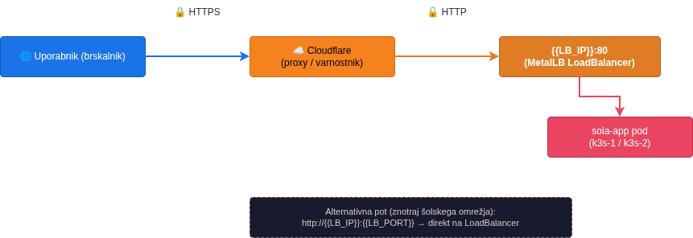

🌐 **Language / Jezik:** [🇸🇮 Slovenščina](../domena.md) | [🇬🇧 English](domena.md)

---

> ⚠️ **Note:** IP addresses, passwords, email addresses, and other sensitive data
> in this documentation are replaced with examples. For actual values, check
> Kubernetes Secrets or contact the administrator.

---

# Domain — how does the internet find us?

Current domain: **`{{DOMAIN}}`** (Cloudflare proxy — orange cloud enabled 🟠)

---

## 📋 What is DNS? (ELI5)

> DNS is the **phonebook of the internet**. When you type `{{DOMAIN}}`, DNS tells your
> browser which IP to go to. Instead of remembering `{{LB_IP}}` (which is an ugly number),
> you remember `{{DOMAIN}}`. That's it.

### Current DNS settings

| Type | Name | Value | Proxy | Purpose |
|------|------|-------|-------|---------|
| A | `{{DOMAIN}}` | `{{LB_IP}}` | ✅ Proxy (orange cloud 🟠) | Application — users come here |
| CNAME | `www` | `{{DOMAIN}}` | ✅ Proxy (orange cloud 🟠) | Redirect www to domain |

---

## ☁️ Cloudflare proxy — what does that mean? (ELI5)

> Cloudflare stands in front of the application like a **security guard**. The user sees
> Cloudflare, not the server directly. Cloudflare filters attacks, handles SSL certificates,
> and speeds up loading. If you're curious who your server is — you can't find out.
> You only see the guard.

**Orange cloud (Proxy) 🟠** — Cloudflare actively forwards traffic. The user
visits `{{DOMAIN}}`, Cloudflare checks if the request is safe, and forwards it
to `{{LB_IP}}`. Everything goes through Cloudflare.

**Gray cloud (DNS only) ⚪** — Cloudflare just says "hey, the IP is `{{LB_IP}}`",
and traffic goes directly from the user to your server. Cloudflare sees nothing,
protects nothing. We use the orange cloud.

In practice, Cloudflare proxy means:
- Public DNS resolves to Cloudflare IPs (not our `{{LB_IP}}`)
- Cloudflare forwards traffic to `{{LB_IP}}` (LoadBalancer, port 80, Flexible SSL)
- Cloudflare handles SSL
- `server: cloudflare` appears in HTTP headers

---

## 🔐 Flexible SSL — half encryption (ELI5)

> Flexible SSL is like **half encryption**. Between the user and Cloudflare it's HTTPS
> (locked 🔒). Between Cloudflare and our server it's HTTP (unlocked 🔓).
> On the school network this is OK, because traffic stays within the trusted network.
>
> If the application were running on a public WiFi at a cafe, that would be a problem.
> But traffic between Cloudflare and `{{LB_IP}}` never leaves the school network.
> For a school, this is good enough.

---

## 🔄 Traffic flow — who sends what to whom




---

## ⚙️ BASE_URL — tells the application what its full web address is (ELI5)

> BASE_URL tells the application what its **full web address** is. It needs this
> for sending emails (when the app says "click this link", it needs to know
> its own address) and for redirects (when it sends you from one page to another).
>
> If BASE_URL were missing or wrong, the app would send email links
> like `http://localhost:3000/...` instead of `https://{{DOMAIN}}/...` — and that
> doesn't work.

Configuration in ConfigMap (`sola-config`, namespace `sola-app`):

```yaml
BASE_URL: "https://{{DOMAIN}}"
```

---

## 📜 Domain change history

| Period       | Domain           | Description                        |
|--------------|------------------|------------------------------------|
| May 2026     | sola-app.local   | Initial local domain (mDNS)        |
| June 2026    | {{DOMAIN}}     | Current production domain 🏆       |

---

## 🛠️ Changing the domain (if ever needed)

If the domain needs to be changed in the future:

### 1. Cloudflare — add new domain and A record

1. Open Cloudflare dashboard
2. Add A record: `@` → `{{LB_IP}}` (Proxy — orange cloud, LoadBalancer)
3. Wait for DNS propagation (can take from a few minutes to 48 hours, usually ~5 min)

### 2. Update BASE_URL in Kubernetes

```bash
kubectl -n sola-app patch configmap sola-config --type merge \
  -p '{"data":{"BASE_URL":"https://new-domain.si"}}'
kubectl -n sola-app rollout restart deployment/sola-app
```

---

## 📖 Common confusions (FAQ for the impatient)

### ❓ Why can't I see my server when I ping `{{DOMAIN}}`?

> Because we have the **orange cloud (Proxy)**. The ping goes to the Cloudflare edge,
> not your server. Cloudflare doesn't allow pings — it returns a timeout. This is
> **normal**. Your server is still alive and well. If you want to see the real IP,
> you'd have to switch to the **gray cloud (DNS only)** — but we don't want that
> because we'd lose Cloudflare protection.
>
> To check the server directly, use `curl -v http://{{LB_IP}}:8002`,
> not ping.

### ❓ Do I need my own SSL certificate?

> No. Cloudflare provides one for free. Since we use **Flexible SSL**, Cloudflare
> terminates HTTPS at its edge and forwards HTTP to your server. Your server
> doesn't need any certificate. If you wanted **end-to-end HTTPS** (Full or
> Full Strict), you would need to install a certificate on the application too
> — currently not needed.

### ❓ What if I change the LoadBalancer IP?

> If you change `{{LB_IP}}` (e.g., MetalLB restart or configuration change),
> you **must update the DNS A record** in the Cloudflare dashboard to the new IP.
> Until you do, Cloudflare sends traffic to the old (non-existent) IP and the
> application won't be accessible. I recommend:
> 1. First set the new IP in Cloudflare
> 2. Wait a minute
> 3. Then change the LoadBalancer

---

## 📌 Notes for the old soul (DevOps)

- **LoadBalancer IP** `{{LB_IP}}` is fixed — it doesn't change on restart (thanks, MetalLB)
- **Cloudflare SSL** is "Flexible" — HTTPS between user and Cloudflare, HTTP between Cloudflare and `{{LB_IP}}` (within the school network — OK)
- **server: cloudflare** appears in HTTP headers — proof that Cloudflare is proxying
- If you wanted **end-to-end HTTPS**, you would need a certificate on the application (currently not needed — don't overcomplicate it)
- DNS propagation can take time. If you just changed DNS and it doesn't work — wait. Don't panic. Run `dig {{DOMAIN}}` after 5 minutes.

---

> **Author:** Matej Čušin  
> **School:** OŠ Toneta Čufarja, Jesenice
