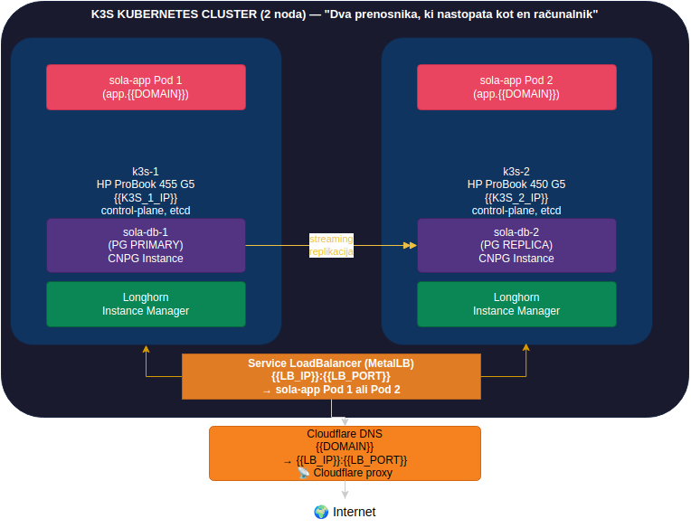
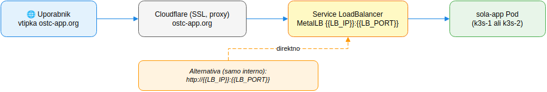
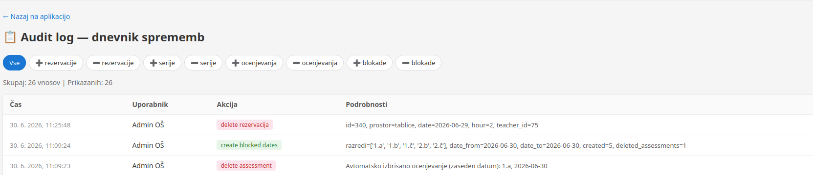

🌐 **Language / Jezik:**   [🇸🇮 Slovenščina](main.md) | [🇬🇧 English](en/main.md)

---

> ⚠️ **Note:** IP addresses, passwords, email addresses, and other sensitive data in this
> documentation are replaced with examples. For actual values, check Kubernetes
> Secrets or contact the administrator.

---

> 🛠️ **Adapt the documentation to your IPs**
>
> All documentation uses a central `.env.ip` file where all IPs, ports and domains
> are defined. Want documentation with your own data?
>
> ```bash
> cd documentation
> nano .env.ip                          # enter your IPs
> ./replace-ips.sh                      # documentation adapts automatically
> ```
>
> The script replaces all IPs in `.md` files. After running, you can copy and
> paste the commands directly into the terminal — they work without modification.
>
> > 💡 **Note:** Placeholders ({{LB_IP}}, {{K3S_1_IP}}, etc.) remain in `.drawio` diagrams — the `replace-ips.sh` script leaves them untouched as they are part of the image.

---

# 🚀 **ostc-app — Reservation System**
## **OŠ Toneta Čufarja — Documentation**

---

## 📚 **Table of Contents**

This file is **the main entry point** — like the reception desk at school that tells you where to find what. Below are links to specialized sub-documents:

| Document | Description |
|---|---|
| [🏗️ **HA Architecture**](../HA.md) | CloudNativePG, automatic failover, node failure procedure |
| [🌞 **Summer Shutdown**](../POLETNA_PAVZA.md) | Safe shutdown of the k3s cluster over summer and restart in autumn |
| [☁️ **Domain and DNS**](../domena.md) | Domain setup, Cloudflare, DNS records |
| [🐍 **Run app locally**](../postavi-lokalni-app.md) | Installation on a single computer (without Kubernetes) |
| [☸️ **K3s setup**](../k3s-setup.md) | Installing the k3s cluster from scratch |
| [⚙️ **Admin/devops instructions**](../admin-devops-navodila.md) | Maintenance, updates, troubleshooting |
| [👩‍🏫 **Teacher instructions**](../navodila-ucitelji.md) | Using the app — reservations and assessments |
| [👑 **Management instructions**](../navodila-vodstvo.md) | Managing via browser (series, blocked dates) |
| [📱 **App description**](../aplikacija-rezervacije.md) | What the app offers, purpose, features |
| [📖 **User instructions**](../navodila-uporabnika.md) | Login, passwords, daily use |

---

## 📑 **Table of Contents**

1. [System Architecture](#system-architecture)
2. [Hardware and Network](#hardware-and-network)
3. [Domain and Cloudflare](#domain-and-cloudflare)
4. [Longhorn Storage](#longhorn-storage)
5. [Daily Backup and Reports](#daily-backup-and-reports)
6. [Audit log — change log](#audit-log--change-log)
7. [Maintenance and Failures](#maintenance-and-failures)
7. [Summer Shutdown](#summer-shutdown)
8. [Complete Command Reference](#complete-command-reference)
9. [Glossary](#glossary)

---

## 🏗️ **System Architecture**

> **In a nutshell:** Two HP ProBook laptops connected in a Kubernetes cluster with high availability (if one crashes, the other takes over).

> **ELI5:** Imagine **two teachers who have the same lesson plan** (application) and **the same two assistants** (database) — one is the main assistant, the other vigilantly watches everything the main one does. If the main one gets sick (crashes), the assistant immediately takes their place. The students (users) don't even notice. Everything is stored in **two safes** (Longhorn), so even if one safe crashes, no data is lost.

> **Simple explanation of the diagram below:**
> - Two computers (k3s-1 and k3s-2) are connected in a cluster — like two desks in the same office.
> - On each computer runs **one copy of the application (sola-app Pod)** and **one copy of the database (sola-db)**.
> - The database has one **primary (PRIMARY)** and one **replica (REPLICA)**, which constantly copies everything the primary does.
> - All data is stored in **Longhorn** — a system that ensures you have 2 copies on 2 different computers, so even if one computer crashes, no data is lost.
> - When a user opens a browser, traffic goes through **Cloudflare** (security filter + SSL) to **MetalLB LoadBalancer** (reception desk), which sends it to one of the two application copies.

### **Hardware and Network Diagram**



> **Note:** Both nodes are `control-plane, etcd` — there are no separate worker nodes. k3s runs user pods on control-plane nodes as well. This is perfectly fine for a smaller cluster — with 100+ nodes you would separate them, but for a school system with two HP ProBooks this is totally OK (plus HA becomes much simpler).

> **Btw:** Both HP ProBooks have the `control-plane` role because k3s allows this without issues. In large companies (Google, Amazon) they have separate control-plane nodes, but there we're talking thousands of nodes. For a school cluster this is perfectly OK — you save hardware and simplify setup.

### **Traffic Flow**

> **Simple explanation:** When a teacher enters `https://{{DOMAIN}}` in a browser, this happens: the browser first asks Cloudflare (the internet's phonebook) where this page is. Cloudflare checks its directory, sees IP {{LB_IP}}, and sends the user there. There they are greeted by **MetalLB** (reception desk), which redirects them to one of the two application copies — whichever is currently free.

> **Cloudflare proxy** points directly to the **LoadBalancer (`{{LB_IP}}`, port 80)** — traffic goes directly to MetalLB, HA works automatically — if one node crashes, MetalLB moves the IP to the other.



> **Tip:** Always use Cloudflare proxy (orange cloud) — not just DNS-only (gray cloud). Proxy gives you free SSL, DDoS protection, and hides your real IP from hackers. If you use only DNS, you publicly expose your IP {{LB_IP}} and anyone can attack it directly.

### **Component Overview**

|  | Component | Location | Purpose |
|---|---|---|---|
| | **k3s-1** | HP ProBook 455 G5 ({{K3S_1_IP}}) | Control-plane, app pod, PG primary (main computer) |
| | **k3s-2** | HP ProBook 450 G5 ({{K3S_2_IP}}) | Control-plane, app pod, PG replica (backup computer) |
| | **Sola App (FastAPI)** | 2 pods (both nodes) | Reservations, assessments, login |
| | **Longhorn** | Both nodes | Distributed storage (PVCs) — data in 2 copies |
| | **MetalLB** | Both nodes | LoadBalancer IP ({{LB_IP}}) — entry gate |
| | **Cloudflare** | External | DNS, SSL, proxy — security on the internet |

---

## 💻 **Hardware and Network**

> **In a nutshell:** Two ordinary HP ProBook laptops, each with 256GB disk, connected to the school's Arnes network — that's all you need for the entire system.

### **Specifications**

> **ELI5:** Imagine you have two office computers. The first one (k3s-1) has 16GB RAM — that's like a bigger desk where you can put more papers. The second (k3s-2) has 8GB RAM — a smaller desk, but still enough for routine work.

| Node | Model | CPU | RAM | Disk | Role |
|---|---|---|---|---|---|
| **k3s-1** | HP ProBook 455 G5 | AMD Ryzen 5 2500U | 16GB | 256GB SSD | Control-plane, etcd, app, PG primary (main) |
| **k3s-2** | HP ProBook 450 G5 | Intel Core i5-8250U | 8GB | 256GB SSD | Control-plane, etcd, app, PG replica (backup) |

> **Btw:** k3s-1 has 16GB RAM, k3s-2 has 8GB. This is not a mistake — the primary database (PG primary) on k3s-1 needs more RAM for cache and WAL buffers. When k3s-2 becomes primary (during failover), it will run a bit slower, but the system will still work.

### **Network Settings**

> **ELI5:** Every computer on the network has its own house address (IP). k3s-1 is at address {{K3S_1_IP}}, k3s-2 is at {{K3S_2_IP}}. Together with other devices in the school they form a neighborhood (/24 means up to 254 devices in the same neighborhood). The gateway ({{GATEWAY_IP}}) is the main door of the school, through which all traffic goes to the internet.

```bash
# Local network (Arnes)
k3s-1: {{K3S_1_IP}}/24
k3s-2: {{K3S_2_IP}}/24
Gateway: {{GATEWAY_IP}}
DNS: {{DNS_IP}}

# Kubernetes Pod CIDR — private addresses within the cluster
# (applications in Kubernetes get these addresses, not visible from outside)
10.42.0.0/16

# Kubernetes Service CIDR — internal addresses for services
10.43.0.0/16

# LoadBalancer IP pool (MetalLB) — public addresses visible on the network
{{METALLB_RANGE_START}} - {{METALLB_RANGE_END}}
```

> **Common mistake:** Pod CIDR (10.42.0.0/16) and Service CIDR (10.43.0.0/16) must not overlap with the local network ({{K3S_1_IP}}/24). If they do, Kubernetes won't be able to route traffic correctly. Always check with `ip route` on the nodes before setting up k3s.

### **Access**

```bash
# SSH to k3s-1 (main)
ssh {{SSH_USER}}@{{K3S_1_IP}}

# SSH to k3s-2 (backup)
ssh {{SSH_USER}}@{{K3S_2_IP}}

# Check if everyone is running
kubectl get nodes
```

> **Tip:** Use SSH keys instead of passwords — safer and faster. k3s-2 already has SSH key access to k3s-1 set up.

---

## ☁️ **Domain and Cloudflare**

> **In a nutshell:** Cloudflare is the **internet's phonebook** — when someone enters `{{DOMAIN}}` in a browser, Cloudflare tells them where (at which IP) to find this application, and handles the secure connection (SSL).

> **ELI5 — DNS:** DNS (Domain Name System) is like a phonebook for the internet. You type in a name (`{{DOMAIN}}`), DNS returns a number (IP address). Instead of remembering the number {{LB_IP}}, you remember the name `{{DOMAIN}}`. Much easier, right?

Cloudflare DNS settings (check at [dash.cloudflare.com](https://dash.cloudflare.com)):

| Type | Name | Value | Proxy status |
|------|------|-------|-------------|
| A | `@` ({{DOMAIN}}) | {{LB_IP}} | ✅ Cloudflare proxy (LoadBalancer) |
| CNAME | `www` | {{LB_IP}} | ✅ Cloudflare proxy (redirects www to the app) |


> **Cloudflare proxy** is like a security guard in front of the door — hides your real IP, encrypts traffic (SSL), blocks attacks. **Always turn on the orange cloud** ☁️🟠

Cloudflare SSL/TLS settings:

- **SSL/TLS encryption mode:** `Flexible`
- **Always Use HTTPS:** ON
- **Minimum TLS Version:** 1.2

> **Tip:** Flexible SSL is fine for a school environment, but if you ever add data that requires PCI-DSS or HIPAA compliance, you would need to use Full (strict) SSL with a Let's Encrypt certificate on the origin server. For scheduling reservations and grades at an elementary school, Flexible SSL is perfectly sufficient.
>
> **What are PCI-DSS and HIPAA?**
> - **PCI-DSS** = Payment Card Industry Data Security Standard — a security standard for **credit card payments** (Visa, Mastercard). If the school ever collected payments through the app (e.g., meals, field trips), it would need to comply.
> - **HIPAA** = Health Insurance Portability and Accountability Act — a US law about **medical data privacy**. Since the app is in Slovenia, not the US, it's not relevant here — it's only mentioned as an example of what requires higher SSL levels.
>
> For a school system with room reservations and grades, **neither applies** — sleep soundly. 😴

> **Common mistake:** If you set SSL/TLS to "Full" without a certificate on the origin, Cloudflare won't be able to establish a connection and users will get a 502 error. Start with "Flexible" (easiest) and upgrade when you add a certificate to the origin.

---

## 💾 **Longhorn Storage**

> **In a nutshell:** Longhorn is a storage system that ensures every piece of data has 2 copies on 2 different computers — if one disk crashes, no data is lost.

> **ELI5 — Longhorn:** Imagine you have an important school logbook. Longhorn is like a **photocopier that photocopies every page immediately to another desk**. If one desk (computer) goes up in flames, you have the photocopy on the other desk. Without Longhorn, your logbook would only be in one place — if that disk crashes, the data is lost forever.
>
> **ELI5 — PVC (PersistentVolumeClaim):** A PVC is a **virtual hard drive** in Kubernetes. The application says "I need 5GB of storage" and Kubernetes + Longhorn provide it — even if the application moves to another computer, the data stays. It's like having a portable disk that you can plug into any computer.

### **Status**

```bash
kubectl get pvc -n sola-app
kubectl get volumes.longhorn.io -n longhorn-system
```

### **PVCs**

| PVC | Size | Access Mode | Usage |
|---|---|---|---|
| `sola-postgresql` | 5Gi | RWO | PG data |
| `sola-postgresql-wal` | 2Gi | RWO | WAL logs |

**PVC explanation for non-technical readers:**

| PVC | What it stores | Why it matters |
|---|---|---|
| `sola-postgresql` (5Gi) | **PG database data** — all tables, indexes, users, reservations, assessments. This is the "main" PVC. | Without this, there is no database. 5Gi is enough for an entire school year. |
| `sola-postgresql-wal` (2Gi) | **Write-Ahead Logs (WAL)** — a journal of every change, written before it is saved to the data files. | Without WAL, the replica cannot keep up with the primary. Used for crash recovery, streaming replication, and point-in-time recovery. |

> **ELI5 — PV (PersistentVolume):** In Kubernetes there are two concepts:
> - **PV** = **actual physical disk** — real storage space on one of the computers.
> - **PVC** = **request** for that disk — the application says "I need 5GB".
>
> Here, you **don't create PVs manually** — **Longhorn does it for you**.
> When you create a PVC (e.g. `sola-postgresql`), Longhorn behind the scenes:
> 1. Creates a PV on one node's disk
> 2. Creates a replica on the other node
> 3. Binds the PVC to that PV
>
> You can check with `kubectl get pv` — you'll see PVs with names like `pvc-...`, all created by Longhorn.

> **ELI5 — WAL (Write-Ahead Log):** Imagine you are writing a test. First you write the answer on a **scratch sheet (WAL)**

**Why two separate PVCs?** PostgreSQL first writes every change to WAL, then to the main data files. Separate PVCs allow different I/O profiles — WAL is sequential writing (fast), data is random read-write access. It also enables separate backup strategies: WAL is archived continuously, data is snapshotted periodically.

**Longhorn replication** (2 copies) ensures data survives the loss of one node. Both PVCs have two replicas — one on each k3s node.

> **Btw:** 5Gi for data and 2Gi for WAL sounds small, but for a school system with a few hundred users and reservations, it's more than enough. PostgreSQL is surprisingly efficient with space — the entire database for a year of work will likely be under 1GB. If you ever get close to the limit, monitor with `kubectl get pvc` and increase the size — Longhorn supports online resize without downtime.

---

## 📅 **Daily Backup and Reports**

> **In a nutshell:** Every night at 4:00 AM, the system automatically sends a database backup to `BACKUP_EMAIL` and a daily status report to `STANJE_MAIL` (both variables from the `.env` file). 

> **ELI5:** Imagine you have a **night guard** who every morning at 4:00:
> 1. **Photocopies the entire school register** and puts it in your mailbox (email).
> 2. **Checks if all computers are running** and sends a report to your email.
>

### **Daily database backup (`sola-db-backup`)**

```bash
# Cron: 04:00 every day (Europe/Ljubljana)
# Sends a full pg_dump of the database to BACKUP_EMAIL
kubectl get cronjob -n sola-app sola-db-backup
```

Creates a complete snapshot of the database (all tables, users, reservations, assessments) and emails it. If data gets lost (disk failure, accidental deletion), you have the backup from last night in your email.

### **Daily status report (`sola-daily-report`)**

```bash
# Cron: 04:00 every day (Europe/Ljubljana)
# Sends a report on node status, Longhorn replicas, and application health to STANJE_MAIL
kubectl get cronjob -n sola-app sola-daily-report
```

The report includes:

- 📊 **Node status** — whether both servers are alive
- 💾 **Longhorn replica status** — whether data is properly replicated
- 🟢 **Application health** — whether everything is running
- ⚠️ **Errors** — any issues found

> **Tip:** Email backup is **reliable and simple** — no extra tools needed, everyone knows how to open email. But email can end up in spam. So once a week also check `kubectl get events -n sola-app --sort-by='.lastTimestamp'` — there you'll see things the email report might not show (OOMKilled, CrashLoopBackOff, failed volume mounts).
>
> **What do these errors mean?**
>
> | Error | Meaning | In practice |
> |-------|---------|-------------|
> | **OOMKilled** | Out Of Memory — the app **ran out of RAM**, Kubernetes killed it | The app is using more memory than allocated (e.g., 128 MB instead of 256 MB). Fix by increasing the `memory` limit in the Deployment YAML. |
> | **CrashLoopBackOff** | The app **keeps crashing and restarting** — it fails quickly every time, Kubernetes keeps trying to restart it | Like a computer that shuts down right after you turn it on. The cause is almost always a code error or wrong config. Check logs: `kubectl logs -n sola-app <pod-name>` |
> | **Failed volume mounts** | The app can't **attach its disk** — Longhorn didn't find the disk or it's broken | Like trying to open a folder on a drive that's unplugged. Check with `kubectl get pv,pvc -n sola-app` and `kubectl get volumes.longhorn.io -n longhorn-system`. |

---

## 📋 **Audit log — change log**




> **In a nutshell:** Every important action (creating/deleting reservations, assessments, users, blocking dates) is automatically recorded in the database with information about **who** did it and **when**.

> **ELI5:** Imagine you have a **sign-in book** at school. Every time someone changes something (adds a reservation, deletes an assessment, creates a user), it gets written in the book — with the time and name. You can go back anytime and check what happened. No guessing, no "who deleted this."

**Access:** Only **admin** — in the Admin panel, click **"Dnevnik dogodkov"** (links to `/history`). Management does not have direct access.

> **Tip:** The audit log is **append-only** — entries can only be added, never deleted. Even if admin deletes a user, the audit trail remains. This is intentional — the audit trail must be immutable.

### How do I access the audit log?

1. Log in as **admin**
2. Click **Admin panel** in the top menu
3. In the Admin panel, click **"Dnevnik dogodkov"**

**Who can see the audit log?**
- **Admin** — yes (via Admin panel → Dnevnik dogodkov)
- **Management** — **no**
- **Teachers** — **no**


**What is logged:**

| Action | Description |
|--------|-------------|
| `create_rezervacija` | Single reservation created |
| `delete_rezervacija` | Reservation deleted |
| `create_series` | Weekly/full-day series created |
| `delete_series` | Entire series deleted |
| `create_ocenjevanje` | Assessment created |
| `delete_ocenjevanje` | Assessment deleted |
| `create_blocked_dates` | Blocked dates added |
| `delete_blocked_date` | Blocked date removed |
| `create_user` | New user created (admin) |
| `update_user` | User updated (admin) |
| `delete_user` | User deleted (admin) |
| `activate_user` | User activated (admin) |
| `deactivate_user` | User deactivated (admin) |

**Not logged:** data reads (who viewed what), failed login attempts — only actual changes.

---

## 🔧 **Maintenance and Failures**

> **In a nutshell:** Most issues can be solved with a single `kubectl get ...` command — see what's not working, and the system handles the rest.

### **Daily Operations**

> **ELI5:** These are your **morning checks**, like before driving a car — check the oil, tire pressure, lights. Here you check whether all computers in the cluster are alive, whether applications are running, whether disks aren't full.

```bash
# Check if all computers are alive
kubectl get nodes

# Check if the application is running (all Pods should be Running)
kubectl get pods -n sola-app

# Check if there is enough disk space
kubectl get pvc -n sola-app

# Check if Longhorn disks are healthy
kubectl get volumes.longhorn.io -n longhorn-system

# Review recent events (errors, warnings)
kubectl get events -n sola-app --sort-by='.lastTimestamp'
```

### **When Something Crashes**

> **ELI5:** Don't panic. Kubernetes is designed to heal itself. Most issues are solved with a single `kubectl get ...` command — look at what's wrong and follow the instructions below.

#### **If a Pod Crashes (app not working)**

```bash
# Find the problematic Pod
kubectl get pods -n sola-app

# Check logs (why did it crash?)
kubectl logs -n sola-app deploy/sola-app --tail=50

# Restart (safe, zero downtime)
kubectl rollout restart deployment -n sola-app sola-app

# Wait for new Pods to start
kubectl rollout status deployment -n sola-app sola-app
```

#### **If an Entire Node is Dead (k3s-1 or k3s-2)**

```bash
# Check if the node is still in the cluster
kubectl get nodes

# If the node is NotReady, wait 2 minutes — k3s will automatically
# move pods to the other node. Check with:
kubectl get pods -n sola-app -o wide

# If pods haven't moved after 5 minutes, manually delete them:
kubectl delete pod -n sola-app --all
# Kubernetes will recreate them on the live nodes
```

> **Tip:** Don't delete Pods unnecessarily. Kubernetes will handle the migration to another node in 2-3 minutes. Only use manual deletion if pods get "stuck" in Terminating or CrashLoopBackOff state for more than 5 minutes. If in doubt, just wait — Kubernetes is smarter than you think.

#### **If the Database is in Trouble**

```bash
# Check CNPG cluster status
kubectl get cluster -n sola

# Check which pods are alive
kubectl get pods -n sola -o wide

# Check Longhorn volume status
kubectl get volumes.longhorn.io -n longhorn-system

# If the primary has failed, CNPG will automatically promote the replica to primary
# Wait up to 2 minutes. Check with:
kubectl logs -n sola deploy/sola-db-1 --tail=50   # primary database
kubectl logs -n sola deploy/sola-db-2 --tail=50   # backup database
```

#### **If All Pods are Pending**

The cause is almost always lack of resources (CPU/RAM) or a Longhorn issue:

```bash
# Check what's happening
kubectl describe pod -n sola-app <pod-name>

# Check node resources
kubectl top nodes

# Check Longhorn
kubectl get volumes.longhorn.io -n longhorn-system
```

**From below:** If the node is reachable and has resources, Kubernetes will sort it out — wait 2 minutes.

> **ELI5:** **Pending** means Kubernetes is trying to start the Pod but can't find a suitable computer (e.g., all are busy or Longhorn isn't available). Like trying to book a classroom when all are occupied — you wait for one to become free.

---

## 🔁 **High Availability (HA)**

> See [🏗️ **HA Architecture**](../HA.md) for details on CloudNativePG, automatic failover, and node failure procedure.

> **In a nutshell:** The system survives the failure of any computer (k3s-1 or k3s-2) without data loss — the application is unavailable for at most 1–2 minutes while the database and application migrate to the surviving computer.

**Failure procedure:**

> **ELI5:** Imagine you have **two office assistants**. One (PG primary) writes everything in the logbook, the other (PG replica) copies everything. If the first one gets sick and goes home, the second immediately takes their place — nothing is lost. The only thing you notice is a bit of confusion for the first 30 seconds, then everything runs as before.

1. **Node crashes** (power outage, OS crash, disk failure)
2. k3s **detects dead node** in ~30s (node timeout)
3. MetalLB **moves LB IP** to the live node
4. **CNPG promotes** replica to primary (~30s)
5. **Application Pods** migrate to the live node
6. System stable in ~60s — total up to 2 min

**Total downtime:** ~1–2 minutes (30s failover delay + ~30s for promotion + time for k3s to detect the dead node)

> **Btw:** 1-2 minutes of downtime sounds like a lot, but in practice this is perfectly acceptable for a school system. A teacher who refreshes the page after 2 minutes will be working normally again — no data is lost because Longhorn handled the replication. Compared to the old system (outage for an entire day until IT arrives), this is a huge improvement.

### **Access**

```bash
# During failover, check what's happening
kubectl get events -n sola --sort-by='.lastTimestamp'
kubectl get cluster -n sola
kubectl get pods -n sola -o wide
```

---

## 🌞 **Summer Shutdown**

See [🌞 Summer Shutdown](../POLETNA_PAVZA.md).

> **Btw:** The summer shutdown is often overlooked, but it is crucial for the longevity of the hardware. HP ProBooks in a cabinet without cooling can easily reach 50°C at idle during summer. Shutting down for 2 months extends the life of disks and batteries. Before shutdown, **mandatorily** take a snapshot of Longhorn volumes and dump the database — "better to have it and not need it, than need it and not have it."

---

## 📋 **Complete Command Reference**

```bash
# === Status ===
kubectl get nodes -o wide                           # Which computers are in the cluster?
kubectl get pods -n sola-app -o wide                # Which applications are running and where?
kubectl get services -n sola-app                    # Which services are available?
kubectl get pvc -n sola-app                         # How much disk space is used?
kubectl get cluster -n sola-app                     # How is the database doing?
kubectl get events -n sola-app --sort-by='.lastTimestamp'  # What happened recently?

# === App Management ===
kubectl rollout restart deployment -n sola-app sola-app          # Zero-downtime restart
kubectl rollout status deployment -n sola-app sola-app           # Monitor update
kubectl logs -n sola-app deployment/sola-app --tail=50           # Last 50 log lines
kubectl logs -n sola-app deployment/sola-app --previous          # Log of the previous (failed) Pod
kubectl exec -it -n sola-app deploy/sola-app -- /bin/sh          # Connect to container terminal (shell)

# === Database Management ===
kubectl exec -it -n sola-app deploy/sola-app -- psql $SOLA_DATABASE_URL                    # Connect to database
kubectl exec -it -n sola-app deploy/sola-app -- psql $SOLA_DATABASE_URL -c "SELECT * FROM users;"  # Run a query

# === Longhorn ===
kubectl get volumes.longhorn.io -n longhorn-system                # Disk status
kubectl get engineimages.longhorn.io -n longhorn-system           # Longhorn engine version
kubectl get nodes.longhorn.io -n longhorn-system                  # Longhorn status on each node

# === Git (on k3s-2) ===
cd /home/admin/reservation_app
git pull                                    # Pull the latest code
```

---

## 📖 **Glossary**

*Explanation of technical terms for non-technical readers — if something in the documentation isn't clear, look here. *

| Term | Explanation |
|---|---|
| **Arnes** | **Academic Research Network Infrastructure of Slovenia** — Slovenian educational internet. The school is connected to the internet via Arnes. |
| **Cloudflare** | **Security guard in front of your server** — encrypts traffic (SSL), hides your IP, blocks attacks, speeds up loading. |
| **CloudNativePG (CNPG)** | **Smart assistant for PostgreSQL database** — automatically manages replication, failover, backup, and recovery. |
| **Cluster** | **A group of computers working as one** — two HP ProBooks connected into the same Kubernetes cluster. Kubernetes ensures applications run on whichever computer is available. |
| **ConfigMap / Secret** | **Kubernetes objects for storing settings** — ConfigMap for public settings (e.g. BASE_URL), Secret for sensitive data (passwords, keys). Secret is encoded, ConfigMap is readable. |
| **Control-plane** | **The "brain" of the cluster** — the control part that makes all decisions. Both HP ProBooks have control-plane, meaning we have two "brains" — if one crashes, the other takes over. |
| **Discord webhook** | **Automatic message sending to Discord** — used for communication with Hermes Agent: you say something, Hermes replies. No automatic notifications (nightly report, backup) — everything goes via email. |
| **DNS** | **Internet phonebook** — converts the name `{{DOMAIN}}` into an IP address {{LB_IP}} (for example). |
| **Docker Image** | **Recipe for an application** — contains the program, libraries, settings. From one recipe you can make multiple identical containers (Pods). |
| **ELI5** | *Explain Like I'm 5* — an explanation style where you avoid technical terms and use everyday analogies. E.g. Kubernetes is not "a container orchestration system" but "an orchestra conductor for applications." |
| **etcd** | **The cluster's memory book** — stores all data about what runs where, what the settings are, who is alive and who is dead. It is the brain of Kubernetes. |
| **Failover** | **Automatic guard change** — when the primary system crashes, the backup automatically takes over its role. In our case, CNPG promotes the replica to primary. |
| **FastAPI** | **Framework for web applications in Python** — sola-app is written in it. Fast, modern, supports automatic documentation. |
| **Git** | **System for tracking code changes** — like "Track Changes" in Word, but for program code. |
| **GitHub Actions** | **Automatic testing and building with every change** — when someone uploads new code to GitHub, a new Docker Image is automatically built. |
| **Helm** | **"App Store" for Kubernetes** — a tool for installing ready-made packages (e.g. Longhorn, CNPG) into Kubernetes. Instead of manually writing YAML, you just say "install Longhorn." |
| **HIPAA** | **U.S. health data privacy law** — *Health Insurance Portability and Accountability Act*. Defines how health data may be stored and transmitted. Since we're a Slovenian school and not a hospital, HIPAA doesn't apply to us — but its principles (encryption, access control, logging) are good practice for any system. |
| **HPA (HorizontalPodAutoscaler)** | **Automatic scaling of application copies** — monitors CPU/RAM usage and adds or removes replicas (2-4) based on load. Like a coffee machine at school — when it's busy, another one turns on. |
| **HTTPS** | **Secure web connection** — HTTP + SSL. A green lock in the browser means the connection is secure. |
| **IoT (Internet of Things)** | **Smart devices connected to the internet** — e.g. smart thermostats, cameras, sensors. k3s is specifically made for these kinds of devices (low power, low specs), but it also runs on laptops — like a camping stove that you can also use in your home kitchen. |
| **k3s** | **Lightweight version of Kubernetes** — specifically made for smaller computers and IoT devices. We use it on HP ProBooks because full Kubernetes is too heavy for laptops. The same `kubectl` commands work for both. |
| **Kubernetes (k8s)** | **Orchestra conductor for applications** — a system that automatically manages where and how your applications run. If one crashes, it automatically starts it elsewhere. |
| **LoadBalancer** | **Reception desk in a building** — directs visitors (users) to the right application. In our case, MetalLB at IP {{LB_IP}}. |
| **Longhorn** | **A system that ensures you have 2 copies of data on 2 different computers** — distributed storage for Kubernetes, made for smaller clusters. |
| **MetalLB** | **LoadBalancer for on-premise environments** — an alternative to cloud LoadBalancers (AWS, Google). Runs right on your computers. |
|| **Node** | **Physical computer in the cluster** — in our case k3s-1 (HP ProBook 455 G5) and k3s-2 (HP ProBook 450 G5). |
|| **PCI-DSS** | **Payment card security standard** — *Payment Card Industry Data Security Standard*. Defines how companies must protect credit card data (Visa, Mastercard). If the school ever collected payments through the app (e.g., meals, field trips), it would need to comply. For the current use (reservations and grades), **it's not relevant**. |
|| **Pod** | **Container with an application** — the smallest unit in Kubernetes. Each pod runs separately: one for the app itself (`sola-app`), another for the database (`sola-db`). Each pod has its own private IP address. |
| **Primary (database)** | **Main database** — the only one that can be written to. All changes go through it. |
| **PVC (PersistentVolumeClaim)** | **Virtual hard drive** — a request for disk space in Kubernetes. Data persists even if the application moves to another computer. |
| **Replica** | **A copy that vigilantly watches the original** — a second database that constantly copies all changes from the primary. Ready to take over if the original crashes. |
| **Replica (database)** | **Backup database** — read-only. Constantly copies changes from the primary. If the primary crashes, it becomes the new primary. |
| **SSH** | **Secure access to a remote computer via command line** — like sitting in front of that computer, even though you're in a different room. |
| **SSL/TLS** | **Encrypted connection (lock in the browser)** — ensures nobody can eavesdrop on the communication between the user and the server. |
| **Uvicorn** | **Server that runs the FastAPI application** — reads Python code and serves it as a web page. Like a waiter who carries food (responses) to customers. |
| **WAL (Write-Ahead Log)** | **Journal of changes before they are written** — PostgreSQL writes every change first to WAL, then to the main data files. This enables crash recovery and replication. |
| **YAML** | **Human-readable format for writing configuration** — similar to JSON, but more readable. In Kubernetes, all settings are written in YAML format. |
| **Zero-downtime (rollout)** | **Update without service interruption** — Kubernetes first starts the new version, waits for it to work, only then shuts down the old one. Users don't notice anything. |

---

*Documentation for sola-app*
