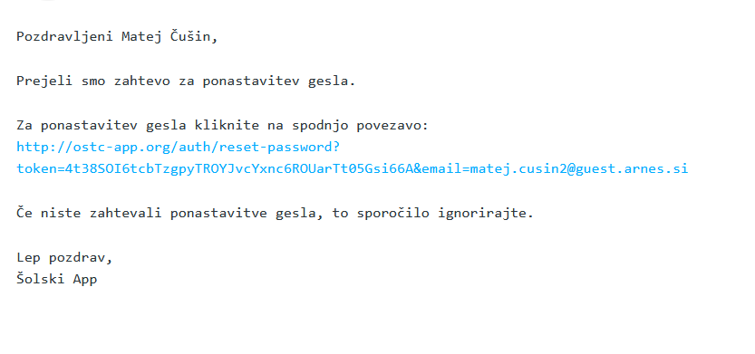
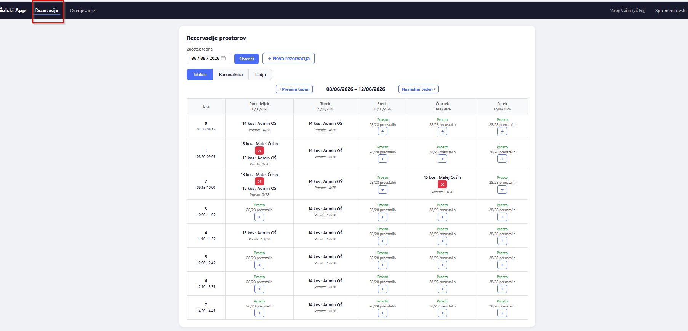
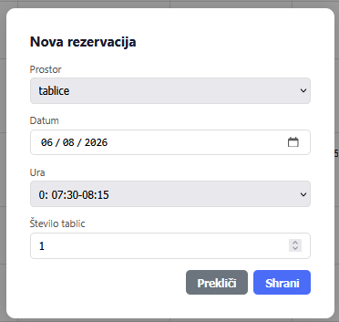
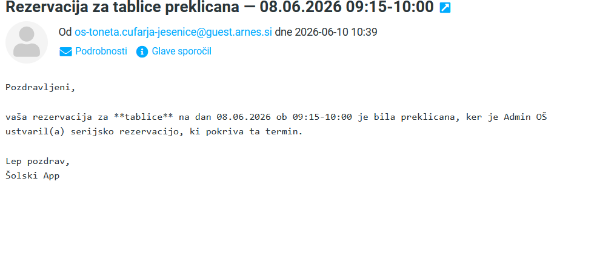
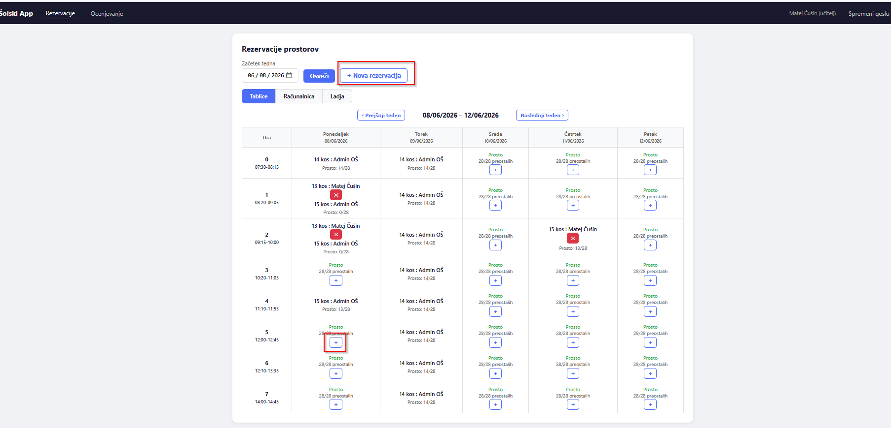
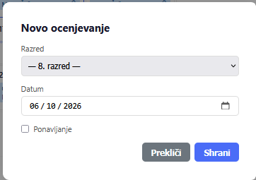
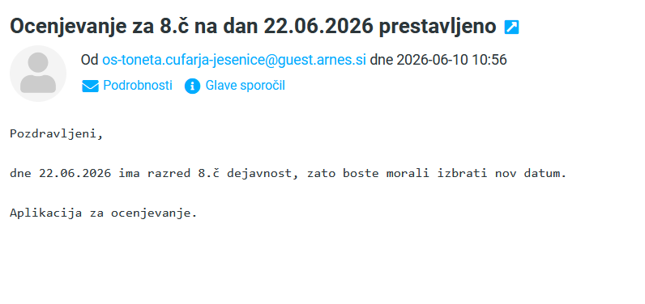
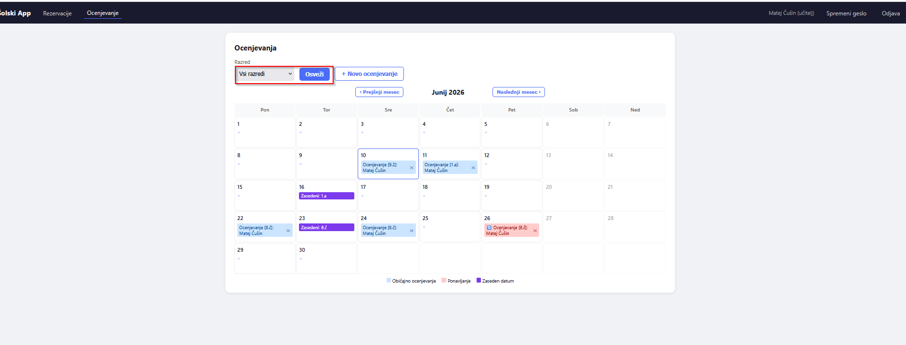

---

> 👋 **Hello, colleagues!**
>
> This app lets you reserve rooms (computer lab, ship, tablets) and schedule written tests. This guide is short and to the point — the screenshots will help you figure everything out in no time. 😊

---

# 👩‍🏫 Teacher Instructions — OŠ Toneta Čufarja Jesenice

---

## 1. How to access the app?

Go to [the app](https://ostc-app.org). To get a password, click **Forgot password?** and enter your **school email address** (@guest.arnes.si). You will shortly receive an email from `os-toneta.cufarja-jesenice@guest.arnes.si`.

If the email doesn't arrive, let the administrator know — they will check if your email address is correctly entered in the database (your message should include your correct email address).

---

## 2. Setting up your password

Click the link in the email and set a new password.

Your password must have:
- ✅ At least **5 characters**
- ✅ At least **one lowercase letter**
- ✅ At least **one UPPERCASE letter**
- ✅ At least **one number**

> 💡 **Example:** `Sola2025` — easy to remember, secure enough.

---

## 3. Logging in

Once you've set your password, log in:

| Field | Enter |
|---|---|
| **Username** | Your school email address |
| **Password** | The password you just set |

> 🛡️ If login doesn't work, try resetting your password a few times first. Only contact the administrator if the issue persists.

After a successful login, the **Reservations** page opens.

---

## 4. Reservations

There are **4 different rooms** available:

| Room | How it works |
|---|---|
| 🖥️ **Computer lab** | Only **one** reservation per slot |
| 🚢 **Ship** | Only **one** reservation per slot |
| 📱 **Tablets** | Multiple teachers can reserve at the same time — max **28 tablets** total |
| 🍳 **Home Economics** | Only **one** reservation per slot |

You can make reservations in **2 ways**:

**Method 1 — click the `+` button in the table:**
The date is automatically set to the one you clicked on (you can also change it manually).

**Method 2 — click the `New reservation` button:**
Fill in all the details in the window that opens.

In this window, select the **Room** from the dropdown menu. The time slots follow the school schedule's last triad. For the **Computer lab**, **Home Economics** and **Ship**, that's all you need. For **Tablets**, you also need to enter the **number of tablets**. Each field shows how many tablets are still available (format `x/28`).

> ⚠️ **Note:** If tablets for a specific slot are already partially reserved, you cannot use the `+` button — use the **New reservation** button instead.

**Deleting a reservation:**
Management can delete **any** reservation, while teachers can only delete **their own**. Management also has 2 additional ways to create reservations. If you already have a reservation for that slot, it will be cancelled (except for tablets, as long as the total isn't exceeded).

---

## 5. Assessments

You can schedule assessments in **2 ways**:

**Method 1 — click on the desired date in the calendar:**
Only works if that date isn't marked as **Blocked** for any class. The date is set to the one you clicked on.

**Method 2 — click the `New assessment` button:**
Select the class and date manually.

**Rules automatically checked by the system (for grades 1 through 7):**

| Rule | Description |
|---|---|
| 📊 **Max 1 test per day** | No class can take more than one test on the same day |
| ✏️ **Max 2 regular tests per week** | Retakes don't count toward this limit |
| 🗓️ **Max 3 assessments total per week** | Including retakes |
| 🔄 **Retakes allow a 3rd test** | But three consecutive days with tests are not allowed |

> ℹ️ For **grades 8 and 9** (group-class labels combining letters and numbers, where the numbers represent groups), the system does not check these rules automatically. Teachers must ensure the rules are followed based on which students are in which group and class.

The window also has a **Retake** checkbox — when checked, the rules change slightly (a 3rd test per week becomes allowed).

---

## 6. Blocked dates

Management can mark certain dates as **blocked** (e.g. sports day). If you already had an assessment scheduled for that day, you will receive an automatic email notification.

The assessment page also has a **filter dropdown**:
Select a specific class or — for grades 8 and 9 — an entire cohort. Filters help you see which days are still available for testing.

> 💡 **Note:** After selecting a filter, click the **Refresh** button to see the updated data.

---

## 7. Changing your password

1. In the menu, click **Change password**
2. Enter your **current password**
3. Enter your **new password** (follow the rules above)
4. Confirm your new password
5. Click **Change password**

> Forgot your password? On the login page click **Forgot password?**, enter your email address and follow the instructions in the email.

---

> 🫶 **I hope this app helps make your work easier. All the best!**
>
> *Matej Čušin*
