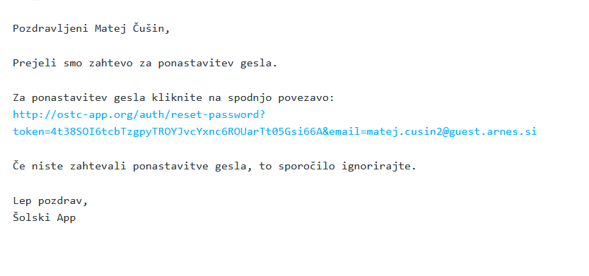
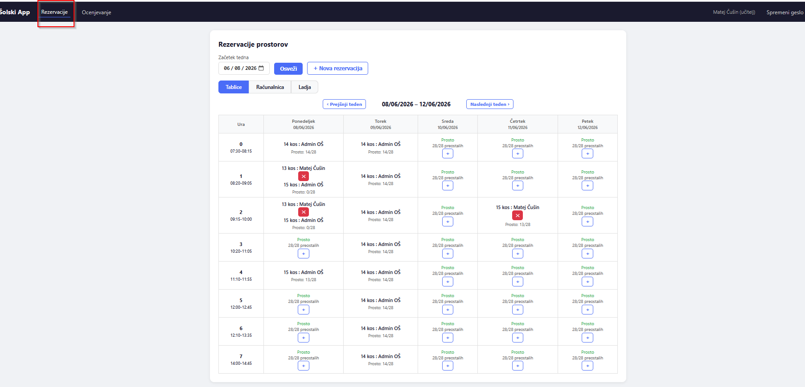
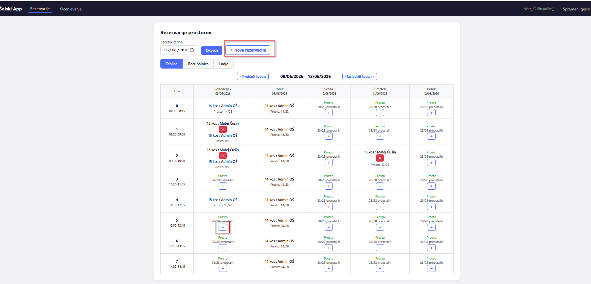
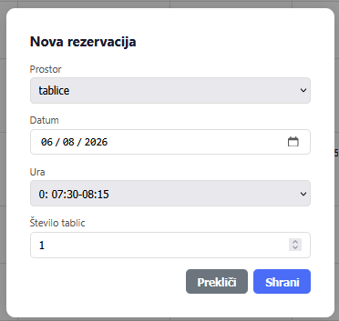
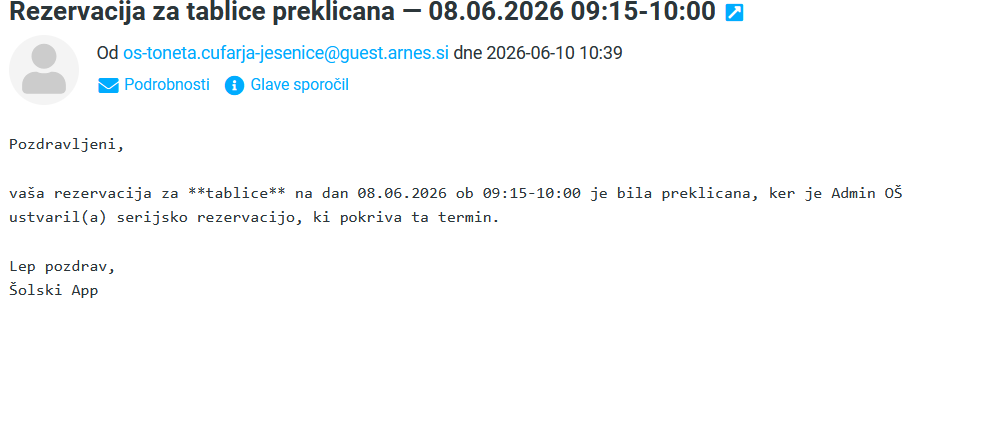
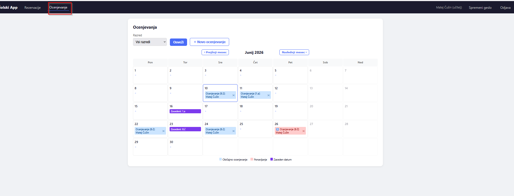
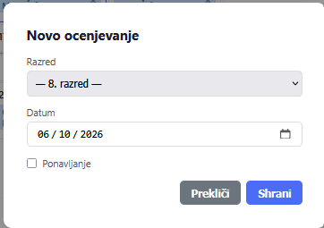
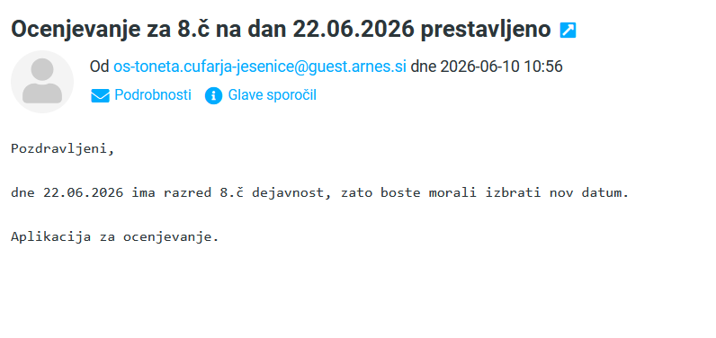
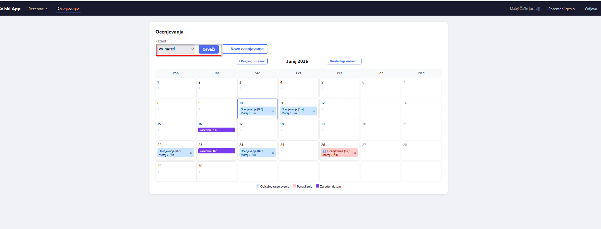

# Aplikacija za rezervacijo prostorov (računalnice, ladje in tablic) in za napoved pisnih testov

## Kako vstopiti v aplikacijo?

Obiščite [aplikacijo](https://ostc-app.org). Da dobite geslo, pritisnite gumb `Pozabljeno geslo?` in vnesite svoj šolski e-poštni naslov. V kratkem boste prejeli e-pošto od `os-toneta.cufarja-jesenice@guest.arnes.si`. Če sporočila ne prejmete, javite administratorju, naj preveri, ali je vaš e-poštni naslov pravilno vnesen v bazo (vaše sporočilo naj vsebuje vaš **pravilen** poštni naslov).

## Nastavitev gesla

V prejetem e-sporočilu kliknite na povezavo in nastavite novo geslo. Geslo mora biti dolgo vsaj 5 znakov ter vsebovati vsaj eno veliko črko, eno malo črko in eno številko.

## Prijava

Ko ste geslo nastavili, se prijavite:

- `Uporabniško ime`: vaš šolski e-poštni naslov
- `Geslo`: geslo, ki ste ga nastavili v prejšnjem koraku

Če prijava ne deluje, najprej sami še nekajkrat poskusite spremeniti geslo. Administratorja kontaktirajte šele, ko se težava ne reši.

Po uspešni prijavi se odpre stran **Rezervacije**.

## Rezervacije

Na voljo so 3 različni prostori:

- `Računalnica` – rezerviramo jo lahko samo enkrat na termin
- `Ladja` – rezerviramo jo lahko samo enkrat na termin
- `Tablice` – na isti termin je možnih več rezervacij, le skupna vsota vseh rezerviranih tablic ne sme preseči skupnega števila razpoložljivih tablic

Rezerviramo lahko na 2 načina:

**S klikom na `+`:**
Datum se samodejno nastavi na datum, pri katerem ste pritisnili `+` (datum lahko tudi ročno spremenite).

**S klikom na `Nova rezervacija`:**
Vse podatke nastavite v oknu, ki se odpre:

V tem oknu izberete `Prostor` iz spustnega menija (s klikom na `˅` se prikažejo vse možnosti; enako velja za ure). Ure so po urniku zadnje triade. Pri `Računalnici` in `Ladji` je to vse, pri `Tablicah` pa morate izbrati tudi število tablic. V vsakem polju je prikazano, koliko tablic je še prostih (oblika `x/28`).

> **Opomba:** Če so tablice za posamezen termin že delno rezervirane, rezervacije prek gumba `+` ni mogoče izvesti – uporabite gumb `Nova rezervacija`.

Vodstvo ima pravico do brisanja katerekoli rezervacije, kolegi učitelji pa lahko brišejo samo lastne. Vodstvo ima poleg tega na voljo še 2 dodatna načina za ustvarjanje rezervacij. Če imate vi za ta termin že rezerviran prostor, se vaša rezervacija ob tem prekliče (razen pri tablicah, kadar skupna vsota ni presežena).

## Ocenjevanje

Ocenjevanje lahko napoveste na 2 načina:

**S pritiskom na polje pri želenem datumu:**
Deluje samo, kadar datum za noben razred ni označen kot `Zaseden`. Datum se nastavi skladno s poljem, na katerega ste pritisnili.

**Z gumbom `Novo ocenjevanje`:**
Ročno izberete razred in datum.

Za razrede od **1. do 7.** aplikacija samodejno preverja naslednje pogoje:

- največ 1 test na dan
- največ 2 navadna testa na teden
- kadar gre za ponavljanje, je dovoljen 3. test v tednu, vendar trije zaporedni dnevi s testom niso dovoljeni

> **Opomba:** Za **8. in 9. razred** (skupinsko-razredne oznake s črkami in številkami, kjer številke predstavljajo skupine) aplikacija teh pogojev ne preverja samodejno. Učitelji morate sami skrbeti za spoštovanje pravil glede na to, kdo je v kateri skupini in razredu.

Tako zgleda okno za ustvarjanje ocenjevanja:

V oknu je na voljo tudi `Ponavljanje` – ko ga obkljukate, se spremenijo pravila za preverjanje (3. test v tednu je dovoljen).

Vodstvo lahko določene datume označi kot zasedene (npr. športni dan). Če ste imeli na tak dan že napovedano ocenjevanje, boste prejeli samodejno e-poštno obvestilo:

Na strani za ocenjevanje je na voljo tudi spustni meni za filtriranje:

Izberete posamezen razred ali – za 8. in 9. razred – celotno generacijo. S filtri lažje pregledate, kateri dan kdo še lahko piše.

> **Opomba:** Po izboru filtra pritisnite gumb `Osveži`, da se prikažejo posodobljeni podatki.

---

Upam, da vam bo aplikacija v pomoč. Želim vam vse dobro pri uporabi!

*Matej Čušin*