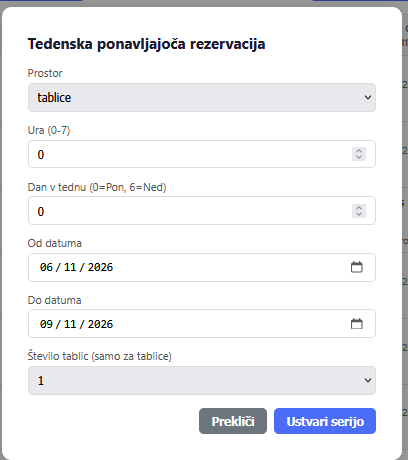
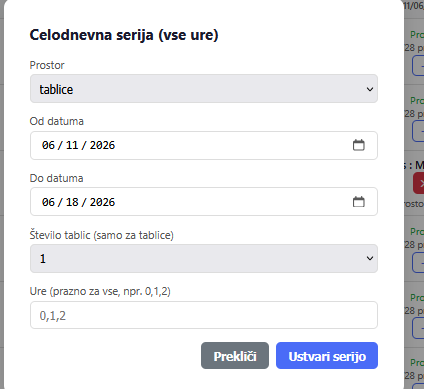
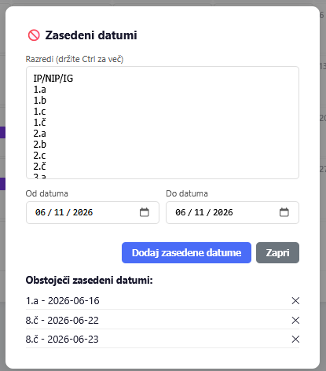
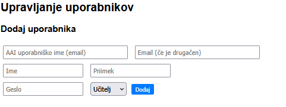
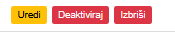
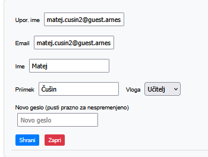

# Navodila za vodstvo in administratorja

> Ta dokument pokriva zgolj upravljanje aplikacije prek brskalnika.

---

## Rezervacije

### Tedenska serija



> **Opomba:** Pri prvem odprtju okna polje za število tablic morda ni vidno. V tem primeru najprej zamenjajte prostor na npr. `Računalnica` in ga nato vrnite nazaj na `Tablice` – polje se bo prikazalo.

| Polje | Opis |
|---|---|
| `Prostor` | Prostor, ki ga želite rezervirati |
| `Ura` | Vrednost od 0 do 7 (0 = predura) |
| `Dan v tednu` | Vrednost od 0 do 6 (0 = ponedeljek, 6 = nedelja) |
| `Od datuma` | Datum začetka serije |
| `Do datuma` | Datum konca serije |
| `Število tablic` | Samo pri tablicah – priporočljivo je določiti število, da si ostale tablice lahko izposodijo drugi |

### Celodnevna serija



| Polje | Opis |
|---|---|
| `Prostor` | Prostor, ki ga želite rezervirati |
| `Od datuma` | Datum začetka serije |
| `Do datuma` | Datum konca serije |
| `Število tablic` | Samo pri tablicah – priporočljivo je določiti število, da si ostale tablice lahko izposodijo drugi |
| `Ura` | Če polje pustite prazno, se rezervirajo vse ure od 0 do 7. Posamezne ure določite tako, da jih naštejete (vrednosti od 0 do 7) ločene s presledkom, npr. `1 3 5` |

---

## Ocenjevanje

### Zasedeni datumi



| Polje | Opis |
|---|---|
| `Razred` | Seznam vseh razredov (vključno s skupinami, označenimi s številko za piko). Izberite vsaj en razred; za izbiro več razredov hkrati držite tipko **Ctrl** med kliki |
| `Od datuma` | Datum začetka zasedenosti |
| `Do datuma` | Datum konca zasedenosti |

Obstoječe zasedene datume si ogledate v seznamu na dnu okna. Posamezen datum odstranite s klikom na `X`. Okno zaprete z gumbom `Zapri`, nov zaseden datum pa potrdite z gumbom `Dodaj zaseden datum`.

Zasedeni datumi se na koledarju prikažejo vijolično, skupaj s seznamom prizadetih razredov.

### Obvestila po e-pošti

Ko vodstvo prekliče rezervacijo prostora ali napoved ocenjevanja, aplikacija samodejno pošlje e-poštno obvestilo učitelju, ki je rezervacijo oz. ocenjevanje ustvaril. Primer sporočila je prikazan v navodilih za učitelje.

---

## Skrbniška plošča (samo admin)

> Ta razdelek je dostopen zgolj administratorju – vodstvo do njega nima dostopa.

### Ročni vnos uporabnikov



Na vrhu skrbniške plošče je možnost ročnega vnosa posameznih uporabnikov. To funkcijo priporočam le med letom, kadar nastopi nov učitelj.

Na začetku vsakega šolskega leta je priporočljivo vse uporabnike izbrisati in jih na novo uvoziti s priloženo skripto, ki samodejno prebere seznam zaposlenih s strani [tonecufar.si/o-soli/zaposleni](https://www.tonecufar.si/o-soli/zaposleni/). Uporabniki bodo morali ob tem znova ponastaviti geslo, toda za administratorja je to bistveno hitrejša in enostavnejša rešitev.

**Lokacija skripte:**

```
/home/admin_os/ostc-app_deli/scripts/import_teachers.py
```

Uporaba iz mape repota:

```bash
cd /home/admin_os/ostc-app_deli
python3 scripts/import_teachers.py --base-url https://ostc-app.org
```

Dry-run (brez dejanskih sprememb):

```bash
python3 scripts/import_teachers.py --dry-run
```

Z vključitvijo administracije/tehničnega osebja:

```bash
python3 scripts/import_teachers.py --base-url https://ostc-app.org --include-all
```

### Iskanje in upravljanje uporabnikov

Na voljo je iskalnik po uporabnikih – išče po e-poštnem naslovu, imenu ali priimku (vrstni red ni pomemben). Pri vsakem zadetku so prikazani trije gumbi:



#### Uredi



V tem oknu lahko:

- popravite napake v imenu, priimku ali e-poštnem naslovu,
- spremenite vlogo uporabnika: `Učitelj` / `Vodstvo` / `Admin`.

> **Priporočilo:** Vloga `Admin` naj bo dodeljena izključno administratorju.

Na voljo je tudi možnost **Spremeni geslo**, ki pa je v praksi redko potrebna, saj si učitelji geslo lahko kadar koli sami neomejeno menjajo.